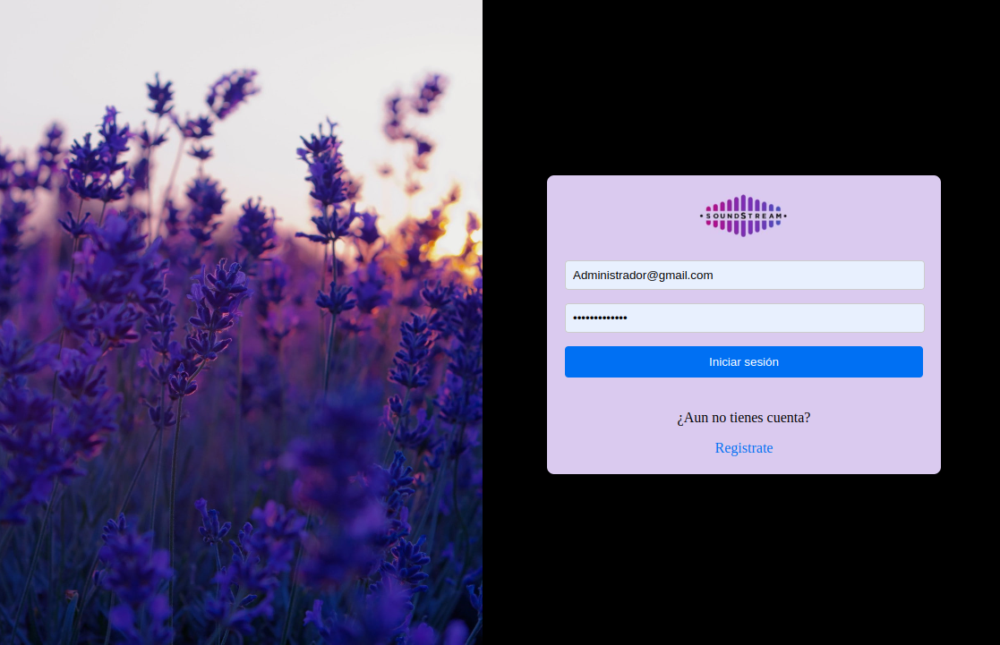
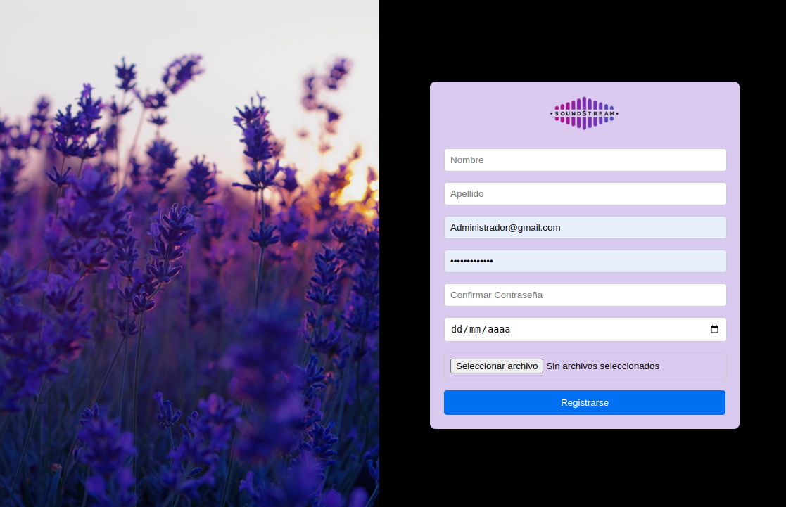
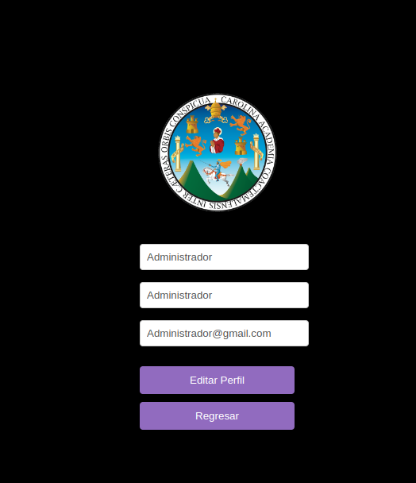
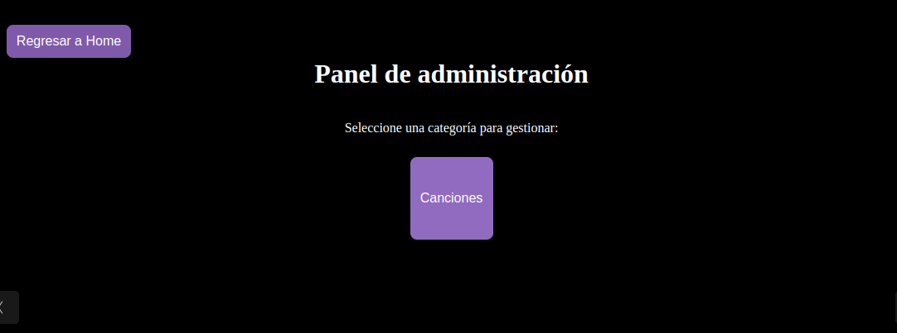
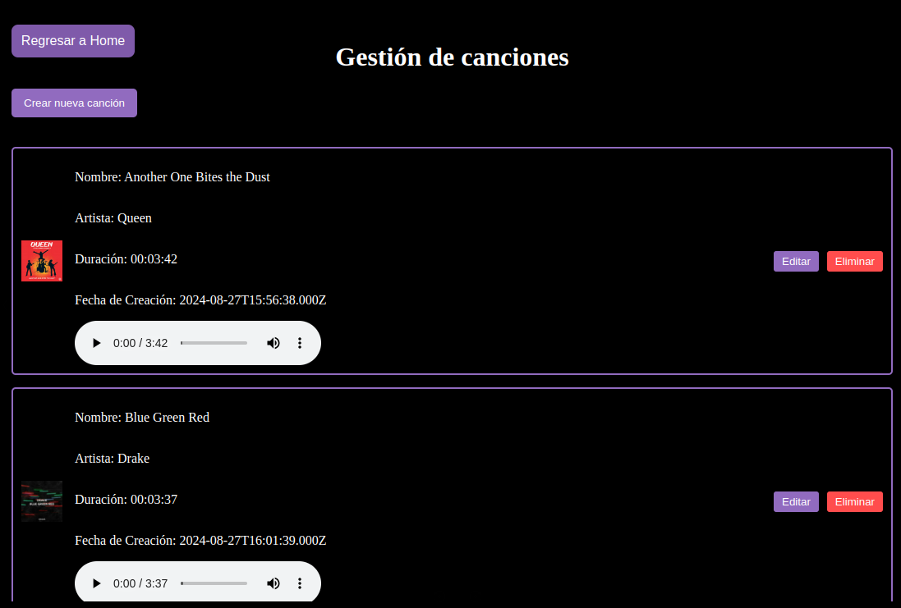
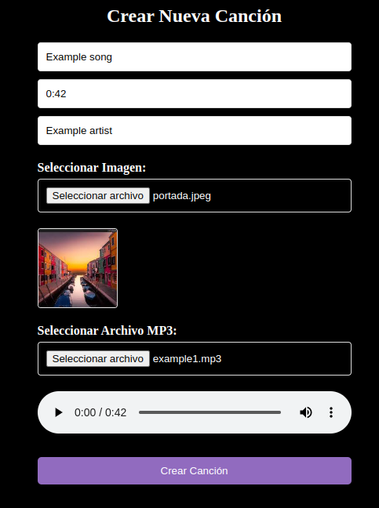
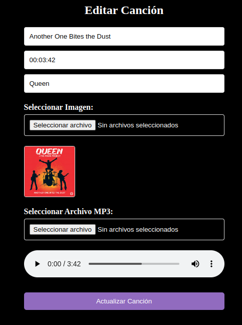
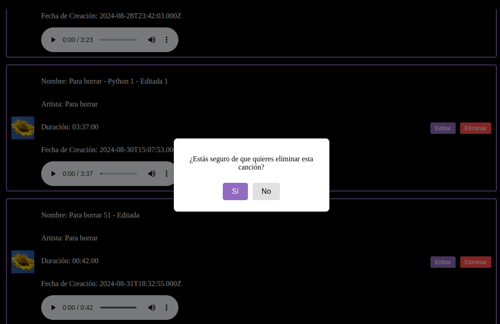

# Manual de Usuario

## 1. Página de inicio de sesión

En la página de login, puedes iniciar sesión en la aplicación ingresando tu correo electrónico y contraseña.

---

## 2. Página de registro

En la página de registro, puedes crear una nueva cuenta proporcionando tu información personal.

- **Nombre**
- **Apellido**
- **Correo electrónico**
- **Fecha de nacimiento**
- **Imagen de perfil**
- **Contraseña**
- **Confirmación de contraseña**

---

## 3. Página de perfil de usuario

En la página de perfil de usuario, puedes actualizar tu nombre, apellido y correo electrónico.

---

## 4. Página de administrador

En la página de admin, se muestran las categorías disponibles para administrar. Actualmente, solo está disponible la categoría "Canciones".

---

## 5. Página de canciones

En la página de canciones, puedes ver un listado de canciones disponibles. Desde aquí, puedes editar o eliminar canciones y abrir la página para crear nuevas canciones.

- **Botón de editar:** Permite editar una canción.
- **Botón de eliminar:** Permite eliminar una canción después de confirmar la acción.
- **Botón para crear canción:** Abre la página para crear una nueva canción.

---

## 6. Página de crear canción

En la página de crear canciones, puedes agregar una nueva canción proporcionando la siguiente información.

- **Nombre de la canción**
- **Duración**
- **Artista**
- **Imagen de canción**
- **Archivo mp3**

---

## 7. Página de editar canción

En la página de editar canción, puedes actualizar los detalles de una canción existente.

- **Nombre de la canción:**
- **Duración:**
- **Artista:**
- **Imagen de canción:**
- **Archivo mp3:**

---

## 8. Eliminar canción

Para eliminar una canción, haz clic en el botón de eliminar junto a la canción en el listado de la página de canciones. Se te pedirá confirmar la acción antes de proceder.

- **Botón de eliminar:** Muestra un mensaje de confirmación para eliminar la canción seleccionada.

---
