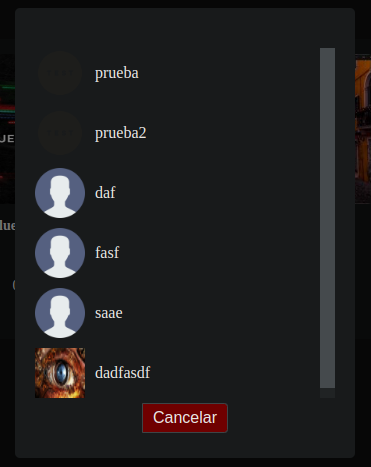

# Manual de Usuario

## 1. Página de inicio de sesión

En la página de login, puedes iniciar sesión en la aplicación ingresando tu correo electrónico y contraseña.

---

## 2. Página de registro

En la página de registro, puedes crear una nueva cuenta proporcionando tu información personal.

- **Nombre**
- **Apellido**
- **Correo electrónico**
- **Fecha de nacimiento**
- **Imagen de perfil**
- **Contraseña**
- **Confirmación de contraseña**

---

## 3. Página de perfil de usuario

En la página de perfil de usuario, puedes actualizar tu nombre, apellido y correo electrónico.

---

## 4. Página de administrador

En la página de admin, se muestran las categorías disponibles para administrar. Actualmente, solo está disponible la categoría "Canciones".

---

## 5. Página de canciones

En la página de canciones, puedes ver un listado de canciones disponibles. Desde aquí, puedes editar o eliminar canciones y abrir la página para crear nuevas canciones.

- **Botón de editar:** Permite editar una canción.
- **Botón de eliminar:** Permite eliminar una canción después de confirmar la acción.
- **Botón para crear canción:** Abre la página para crear una nueva canción.

---

## 6. Página de crear canción

En la página de crear canciones, puedes agregar una nueva canción proporcionando la siguiente información.

- **Nombre de la canción**
- **Duración**
- **Artista**
- **Imagen de canción**
- **Archivo mp3**

---

## 7. Página de editar canción

En la página de editar canción, puedes actualizar los detalles de una canción existente.

- **Nombre de la canción:**
- **Duración:**
- **Artista:**
- **Imagen de canción:**
- **Archivo mp3:**

---

## 8. Eliminar canción

Para eliminar una canción, haz clic en el botón de eliminar junto a la canción en el listado de la página de canciones. Se te pedirá confirmar la acción antes de proceder.

- **Botón de eliminar:** Muestra un mensaje de confirmación para eliminar la canción seleccionada.

---

## 9. Pagina Home

En la página de home, se tiene la parte visual de canciones, se tiene la parte superior, la parte de opcines y la visualizacion de las canciones

---

## 10. Pagina Home - playlist

En la página de home, se tiene la parte visual de canciones, al seleccionar playlist se le abrira una parte visual donde se tienen todas las playlist incluida la de favoritos

---

## 11. Pagina Home - playlist agregar

En la parte de playslist al precionar el icono de mas se desplega una ventana que solicitara los datos para crear una nueva playlist

---

## 12. Pagina Home - Parte Visual reproductor

En la parte de inferios de la pantalla se tiene la parte de reproductor, se tiene la imagen, nombre de cancion y el nombre del artista de la cancion, a su lado derecho tenemos 3 botones que nos serviran para interacutar con las canciones en cola y como parte final la barra de reproduccion de la musica como tambien la duracion de la cancion

---

## 12. Pagina Home - Parte Visual Playlist

En la parte tiene la vista la playlist que tendra la lista de sus canciones

<table>
  <tr>
    <td style="vertical-align: middle; text-align: center;">
      
    </td>
    <td style="vertical-align: middle; text-align: left;">
      <strong>Reproducir</strong> Al presionar se reproducirá la canción seleccionada o toda la lista si se selecciona la de la parte superior
    </td>
  </tr>
</table>

<table>
  <tr>
    <td style="vertical-align: middle; text-align: center;">
      
    </td>
    <td style="vertical-align: middle; text-align: left;">
      <strong>Me gusta</strong> Al precionar se agregara a favortivos
    </td>
  </tr>
</table>

<table>
  <tr>
    <td style="vertical-align: middle; text-align: center;">
      
    </td>
    <td style="vertical-align: middle; text-align: left;">
      <strong>Eliminar</strong> Al precionar se eliminara la cancion selecionada en la playlist o si se selecciona la de la parte de superios se eliminara la playlist por completo
    </td>
  </tr>
</table>

---
## 13. Pagina Home - Parte superior

En la parte de superior de la pantalla se tiene el icono de usuario que al precionar nos dirigira a la parte de [perfil de usuario](#3-página-de-perfil-de-usuario)

**Buscador** en esta parte al realizar una busqueda se nos estara dando una lista de canciones que coinciden con la busqueda

**sign out** se nos cerra sesion y nos dirigira a la [pagina de inicio de sesion](#1-página-de-inicio-de-sesión)

---
## 14. Pagina Home - Radio

En la parte de opciones se tiene Radio, al precionarse estara reproduciendo toda las canciones en forma aleatroria, y se proda ver que cancion se reproduce en la [barra de reproduccion](#12-pagina-home---parte-visual-reproductor)

---
## 14. Pagina Home - Cancion

Al mover el cursor sobre una cancion tendremos tres opciones que cerran reproducir, me gusta y agregar

<table>
  <tr>
    <td style="vertical-align: middle; text-align: center;">
      
    </td>
    <td style="vertical-align: middle; text-align: left;">
      <strong>Reproducir</strong> Al presionar se reproducirá la canción seleccionada
    </td>
  </tr>
</table>

<table>
  <tr>
    <td style="vertical-align: middle; text-align: center;">
      
    </td>
    <td style="vertical-align: middle; text-align: left;">
      <strong>Me gusta</strong> Al precionar se agregara a favortivos
    </td>
  </tr>
</table>

<table>
  <tr>
    <td style="vertical-align: middle; text-align: center;">
      
    </td>
    <td style="vertical-align: middle; text-align: left;">
      <strong>Agregar</strong> Se desplegara la lista de playlist y al seleccionar una se estara agregando a la playlist seleccionada
    </td>
  </tr>
</table>

---

