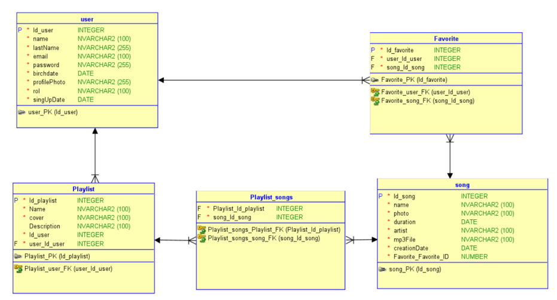
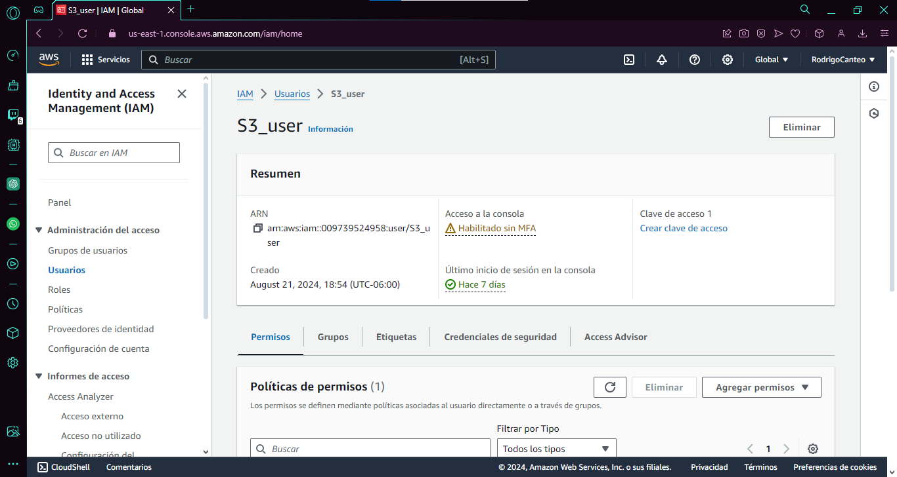
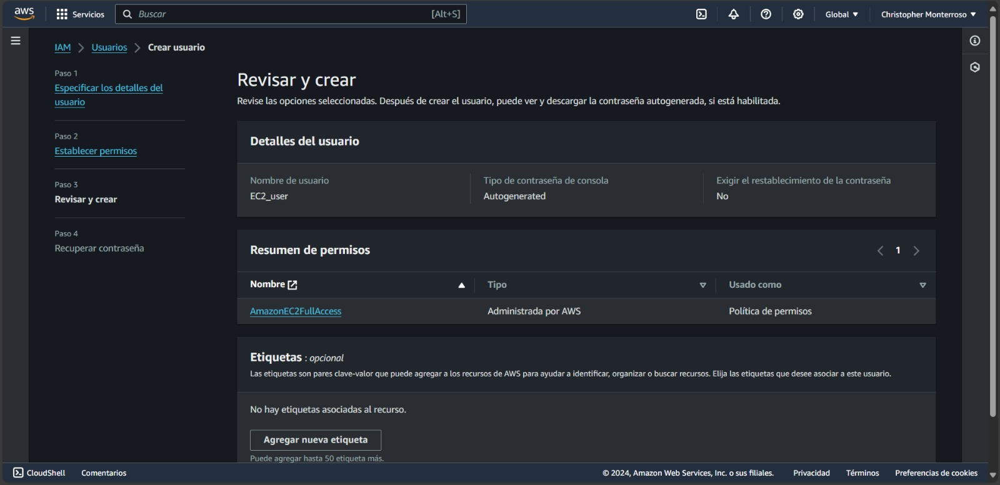
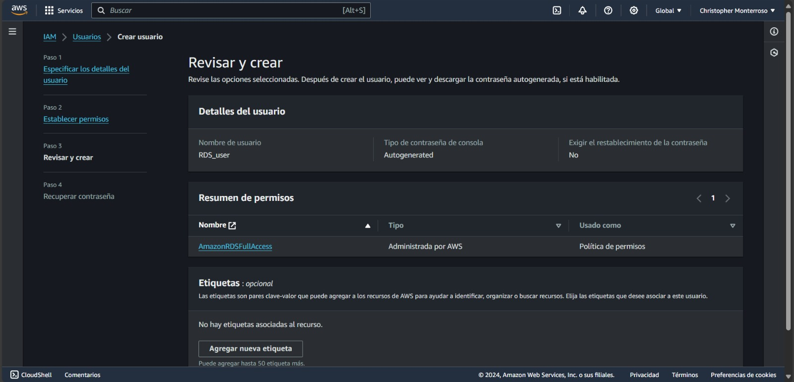

# Manual Tecnico

## Objetivos

**Objetivo General:**

* Implementar los servicios de seguridad y desarrollo de AWS para la aplicación web SoundStream.

**Objetivos Específicos:**

* Crear un entorno de desarrollo para una aplicación web.
* Implementar una arquitectura personalizada utilizando servicios de AWS.
* Integrar servicios y APIs de AWS para soportar la funcionalidad de la aplicación.

## Arquitectura

La arquitectura de SoundStream está diseñada para ser una plataforma de streaming de música completamente en la nube, utilizando los servicios de AWS para garantizar escalabilidad, seguridad, y disponibilidad. La aplicación consta de varios componentes principales, cada uno implementado utilizando un servicio específico de AWS:

* **S3 (Simple Storage Service):**
  * **Bucket 1:** Alojamiento del sitio web estático.
  * **Bucket 2:** Almacenamiento de archivos multimedia (canciones e imágenes).
* **EC2 (Elastic Compute Cloud):**
  * **Instancias:** Dos instancias configuradas para ejecutar servidores que manejan las solicitudes de la aplicación.
  * **Lenguaje:** Servidores implementados en Node.js y Python.
* **Load Balancer:**
  * **Balanceador de carga:** Distribuye el tráfico entre las dos instancias de EC2, asegurando alta disponibilidad y manejo eficiente de las solicitudes.
* **RDS (Relational Database Service):**
  * **Base de datos:** Almacena la información de usuarios, playlists, canciones, y demás datos relevantes.
* **IAM (Identity and Access Management):**
  * **Usuarios y roles:** Gestión de permisos y acceso a los diferentes servicios de AWS.

**Flujo de Trabajo:**

1. Los usuarios acceden al sitio web alojado en el bucket S3.
2. Las solicitudes de la aplicación son manejadas por el balanceador de carga, que las distribuye entre las instancias de EC2.
3. Las instancias de EC2 procesan las solicitudes, interactuando con la base de datos en RDS y el almacenamiento en S3 según sea necesario.
4. IAM gestiona el acceso seguro a los recursos de AWS.

## Diagrama Entidad Relación

## Descripción de Usuarios

Para garantizar un acceso seguro y segmentado a los servicios de AWS, se crearon usuarios específicos en IAM, cada uno con permisos limitados a un servicio particular:

* **S3\_user:**
  * **Política:** Acceso completo a los buckets de S3 relacionados con la aplicación.
  * **Acciones:** Gestión de archivos y configuración de los buckets `sound-stream-semi1-seccion-g2` y `multimedia-semi1-B-g2`.
* **EC2\_user:**
  * **Política:** Permisos para gestionar instancias de EC2, incluyendo la creación, modificación, y monitoreo de las mismas.
  * **Acciones:** Despliegue y mantenimiento de las instancias EC2 que ejecutan los servidores de la aplicación.
* **RDS\_user:**
  * **Política:** Permisos para gestionar la instancia de RDS, incluyendo la administración de la base de datos, ajustes de rendimiento y backups.
  * **Acciones:** Gestión y administración de la base de datos relacional que almacena la información de usuarios, playlists, y canciones.
* **LoadBalancer\_user:**
  * **Política:** Permisos para configurar y gestionar el balanceador de carga.
  * **Acciones:** Configuración del balanceador de carga para distribuir el tráfico entre las instancias de EC2 y monitoreo del estado del balanceador.

Cada usuario fue creado con políticas personalizadas para restringir su acceso únicamente a las acciones necesarias para el servicio específico al que están asignados, garantizando así un control granular de la seguridad en la gestión de la infraestructura de SoundStream.

## Configuración de Servicios

### **S3 (Simple Storage Service):**

1. **Bucket para el Sitio Web Estático:**
   * **Captura:**
     * 
   * **Descripción:**
     * Se creó un bucket llamado `sound-stream-semi1-b-g2`.
     * Se habilitó la opción de "Static Website Hosting" para alojar el sitio web estático.
     * Los archivos HTML, CSS y JavaScript de la aplicación se subieron al bucket.
     * Se configuraron las políticas de acceso público para permitir que cualquier usuario pueda acceder al sitio web.
2. **Bucket para Almacenamiento Multimedia:**
   * **Descripción:**
     * Se creó un segundo bucket llamado `multimedia-semi1-b-g2`.
     * Dentro de este bucket, se crearon dos carpetas: `Fotos` y `Canciones`.
     * Las imágenes de los usuarios, portadas de playlists y canciones en formato `.mp3` se almacenan en estas carpetas.
     * Se configuraron políticas de acceso público para que estos archivos puedan ser accedidos desde la aplicación web.

### **EC2 (Elastic Compute Cloud):**

1. **Instancias de EC2:**
   * **Captura:**
     * 
   * **Descripción:**
     * Se crearon dos instancias de EC2, cada una ejecutando servidores en Node.js y Python.
     * Se eligió el sistema operativo basado en Linux (por ejemplo, Amazon Linux 2).
     * Se instalaron los entornos de ejecución necesarios (`Node.js` y `Python`) en cada instancia.
     * Las instancias se configuraron con los puertos necesarios abiertos en los Security Groups (por ejemplo, puertos 80 y 443 para HTTP/HTTPS).
     * Las instancias se asociaron con un Elastic IP para asegurar que tengan una dirección IP pública fija.

### **Load Balancer:**

1. **Configuración del Balanceador de Carga:**
   * **Descripción:**
     * Se configuró un balanceador de carga de tipo "Application Load Balancer" (ALB) para distribuir el tráfico entre las instancias de EC2.
     * Se definieron reglas de enrutamiento para redirigir las solicitudes HTTP/HTTPS a las instancias de EC2.
     * Se configuraron verificaciones de salud para asegurarse de que las instancias de EC2 estén en buen estado antes de dirigirles el tráfico.
     * Se estableció el balanceador de carga como el punto de entrada principal para la aplicación web, asegurando alta disponibilidad y redundancia.

### **RDS (Relational Database Service):**

1. **Instancia de RDS:**
   * **Captura:**
     * 
   * **Descripción:**
     * Se creó una instancia de RDS con el motor de base de datos que se prefiera (por ejemplo, MySQL, PostgreSQL).
     * Se configuraron parámetros como el tamaño de la instancia, la cantidad de almacenamiento asignado, y los ajustes de rendimiento.
     * Se estableció una política de copias de seguridad automáticas para garantizar la recuperación de datos.
     * Las contraseñas de los usuarios se encriptaron antes de almacenarse en la base de datos, utilizando una librería como `bcrypt`.

## Conclusiones

El proyecto SoundStream ha sido exitosamente implementado utilizando una combinación de servicios de AWS, lo que proporciona una infraestructura escalable, segura y altamente disponible. La arquitectura personalizada permite manejar eficientemente el tráfico de usuarios y gestionar contenido multimedia. Con la configuración adecuada de permisos y roles en IAM, se garantiza que solo los usuarios autorizados puedan acceder y modificar los recursos necesarios. Este manual técnico proporciona una guía detallada para replicar la implementación de la arquitectura y mantener el sistema a largo plazo.
